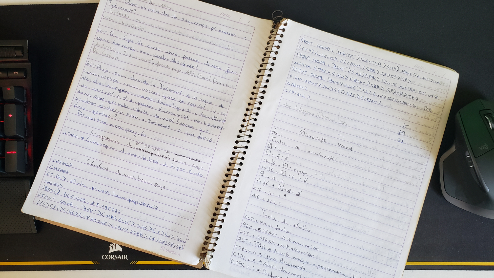

# My First Homepage

This is the first website I ever wrote, back in 2000, when I was first learning about computers and the Internet.

I had no idea what I was doing back then. I just copied it from a whiteboard, saved it into a .html file using 
Microsoft Notepad and opened the file on my browser (Internet Explorer 5!) and my head exploded! It was the 
first time I learned I could tell the computer what to do instead of just doing things myself by clicking around 
on buttons.

I was so fascinated by this that I copied it on my notebook so I could try it at home. Here it is:

After that, it took years for me to realize I wanted to become a software developer (I didn't even know that 
software development was a thing!), but this was the beginning of everything.

If you want to see the page in action, go to https://davialexandre.github.io/my-first-homepage/index.html
